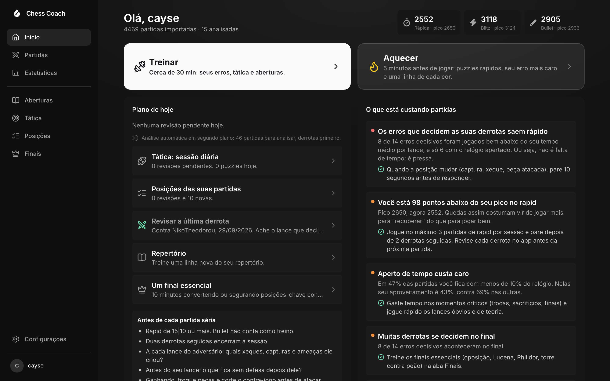
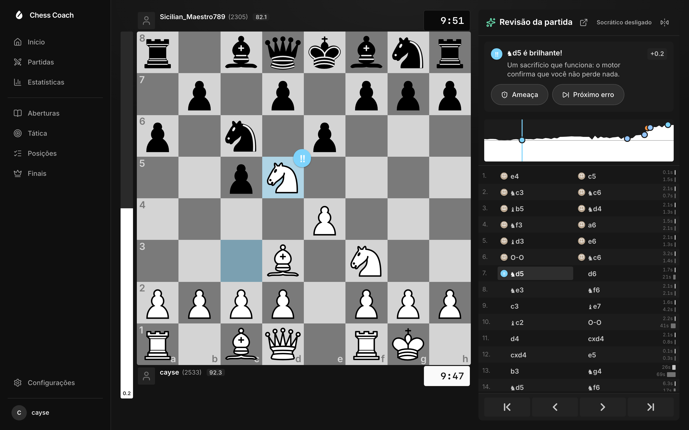
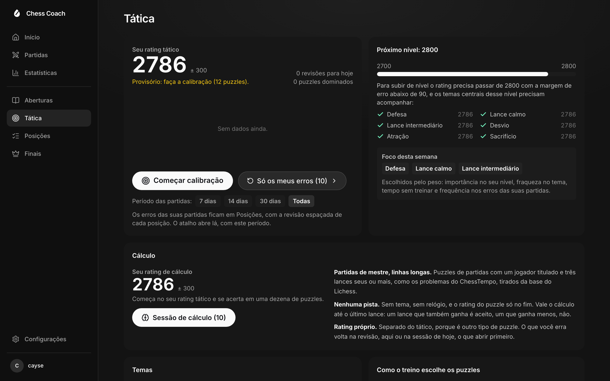
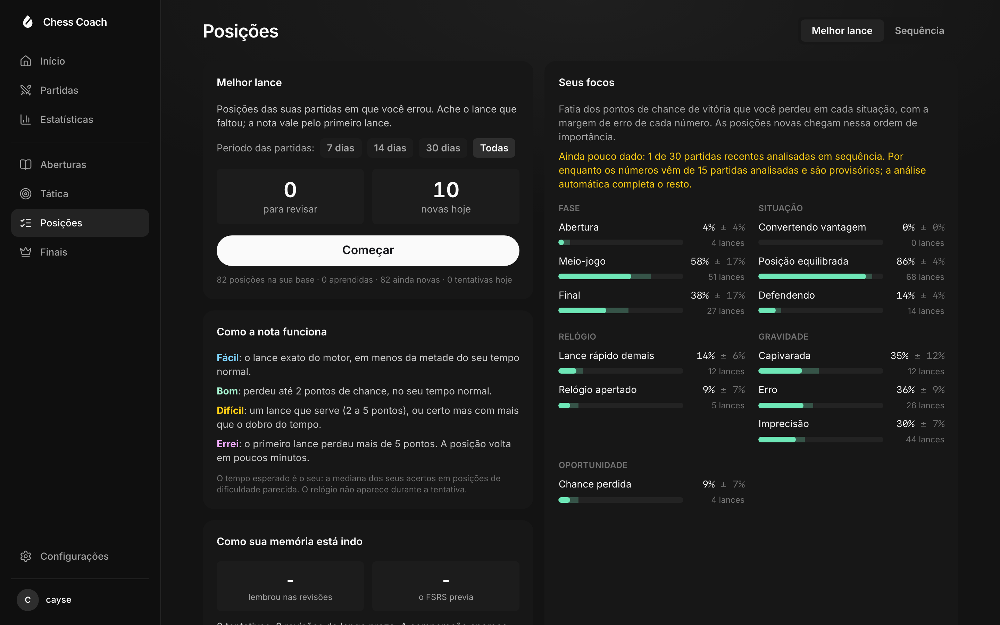
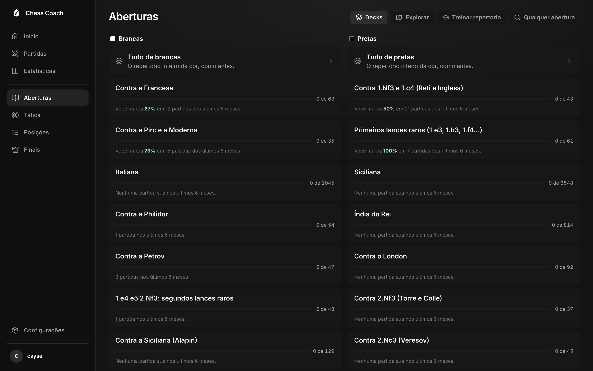
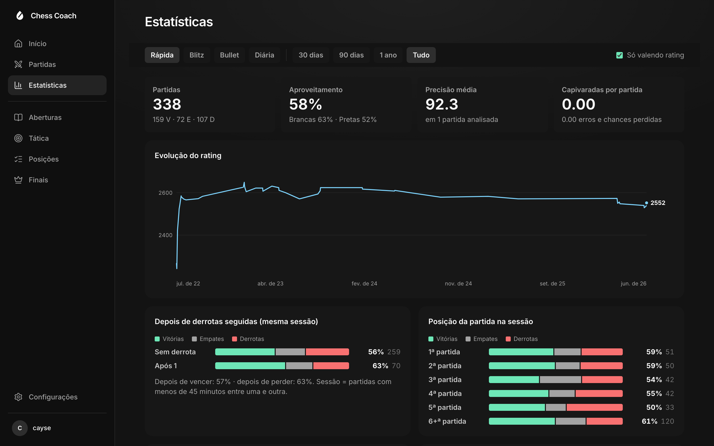

# Chess Coach

[](https://github.com/gabriel-kohler/chess-coach/actions/workflows/ci.yml)
[](LICENSE)

[Leia em português](README.pt-BR.md)



A personal chess trainer that runs in your browser, with no account and no
subscription. It imports your chess.com games, reviews them with Stockfish 18,
shows where you lose games, and builds a daily training session out of your
own mistakes: tactics that follow your level, your opening repertoire with
spaced repetition, the positions you got wrong, and the essential endgames
against the engine.

Games, analyses and progress live in your browser's IndexedDB. Nothing is sent
to a server of ours; there is none.

> The interface is in Brazilian Portuguese. Code and comments are in English.
> Not affiliated with chess.com or Lichess.

## Getting started

Requires Node 22 or newer.

```bash
npm install            # also copies Stockfish (WASM) into public/stockfish
npm run build:puzzles  # downloads the Lichess puzzle database (~300 MB) into public/puzzles
npm run setup:maia     # optional: Maia-2 model, predicts what players at your level play
cp .env.example .env.local   # optional tokens, see below
npm run dev            # http://localhost:5180
```

On first launch, enter your chess.com username. The first sync downloads every
game (6,500 take about 15 seconds); later syncs fetch only new months.

### Optional features

These run on the local Vite server so tokens never reach the browser. Set them
in `.env.local`:

| Variable | What it enables |
|---|---|
| `LICHESS_TOKEN` | The Lichess opening explorer filtered by rating: what people at your level play, and the "punish" decks. A free personal token with no scopes, from [lichess.org/account/oauth/token](https://lichess.org/account/oauth/token). |
| `ANTHROPIC_API_KEY` | LLM narration in the move-by-move coach. The model only rewrites engine-verified facts; every move it mentions is checked and the answer is dropped if it cites anything else. |

Without them the app works fully, minus those features. The FSRS optimizer and
both proxies need the Node server, so a plain static deploy of `dist/` loses
them.

### Scripts

| Command | What it does |
|---|---|
| `npm test` | Tests (Vitest) |
| `npm run typecheck` | TypeScript check |
| `npm run build:openings` | Regenerates `src/data/openings.json` (names and theory from lichess-org/chess-openings) |
| `npm run build:repertoire` | Compiles `src/data/repertoire/*.pgn` into `public/repertoire.json`, checking every move with Stockfish |
| `npm run extend:repertoire` | Suggests repertoire extensions from the explorer (needs `LICHESS_TOKEN`) |
| `node scripts/eval.mjs "e4 e5 Nf3" --depth=18` | Quick engine query on a position |

## Screens

- **Home**: the day's plan, a tilt alarm (two losses in a row today in
  rapid or blitz tell you to stop) and what is costing you games.
- **Train / Warm-up**: one button, one session with every exercise in a row.
  It is saved as you go, so leaving and coming back resumes where you stopped.
- **Games**: history with filters (including "wins that got away") and batch
  analysis in the background.
- **Review**: evaluation bar, accuracy, move classification counts, graph,
  move-by-move coach, best-move arrow, "retry" on your mistakes (checked by
  the engine), "next mistake" and free exploration with the live engine.
  Shortcuts: arrows, Home/End, `f` to flip.
- **Stats**: rating, tilt (after losses, position in the session), time of
  day, weekday, opponents, how games end, clock, the phase where losses are
  decided, and openings.
- **Openings**: your repertoire as decks ("my Sicilian", "against the
  London"), crossed with your games (what you face, where you leave the line,
  where the opponent leaves the book), drilled with spaced repetition, plus
  "punish" decks with the mistakes people at your opponents' level really make.
- **Tactics**: daily sessions built by the algorithm below.
- **Positions**: positions from your analysed games where your move lost 5+
  win-chance points. Two modes scheduled with FSRS: find the best move, and
  play the sequence against the replies people at your level really play.
- **Endgames**: 10 essential endgames verified with the engine. Convert or
  hold against Stockfish at full strength.
- **Level**: when your rapid rating reaches a new band, your games there next
  to the ones before, with the Maia calibration and repertoire gaps.

After each sync the app refreshes on its own: new position cards, analysis of
new games, the level review and, when idle, the Maia calibration and
repertoire gap suggestions.

## Screenshots

Imported from a public chess.com account.

| Game review | Tactics |
|---|---|
|  |  |
| **Positions** | **Openings** |
|  |  |
| **Stats** | |
|  | |

## How the review classifies moves

Classification uses chess.com's published thresholds, in win-chance points
lost: best (0), excellent (up to 2), good (up to 5), inaccuracy (up to 10),
mistake (up to 20), blunder (over 20). On top of that:

- **Brilliant**: the best move (or close) that sacrifices material (net of
  what the move itself captured), with the position still good and not
  already completely winning.
- **Great**: the only good move (the second best loses 10 points or more),
  as long as it is not a capture and the game is not decided. Recapturing or
  taking a hanging piece stays "best".
- **Miss**: the opponent had just erred (or there was a mate) and the move let
  the chance slip.
- **Book**: the moves chess.com counts as theory, read from the end of the
  game's opening link (`...-Old-Sicilian-Variation-3.Bc4-e6` is book up to the
  6th ply, even by transposition). Without them, positions from the Lichess
  openings database.

chess.com's accuracy formula is closed. Ours uses the shape of the Lichess
formula with constants fitted to the accuracy chess.com published for 68
games (around 1350, rapid and bullet): mean error of 2.6 points per player,
against 7.7 for the plain Lichess formula, which ran 4 points high on
average. The differences from Lichess: a flatter win-chance curve (at club
level +3 still loses, so erring in a won position still costs), accuracy
dropping faster per point lost, and a harmonic mean where each move counts at
least 25, so one disaster weighs like on chess.com instead of sinking the
whole game. The constants are in `ACCURACY` (`src/lib/review/scoring.ts`).
chess.com's model depends on rating, so the fit holds for that level.

The engine differs too (chess.com reviews with Torch), so the best move
sometimes differs and the count of "best" does not match exactly.

Changing classification or accuracy does not rerun the engine: on launch,
stored analyses are recomputed from the saved Stockfish lines.

## The tactics algorithm

Puzzles come from the Lichess database (CC0): of 6.1 million, the ~2.9
million well-calibrated ones are kept (rating deviation up to 90, popularity
80+, 300+ plays) and, of those, 251 thousand stratified by 50-point band and
theme. It reproduces what Chess Tempo does best (it has no public API and
forbids downloading its problems): rating per theme, untimed mode, spaced
review of mistakes, and accepting alternative winning moves (checked by the
engine).

A session mixes:

1. **Reviews**: missed puzzles come back after 1, 3, 7, 16 and 35 days,
   until you solve them first try four times in a row.
2. **Your mistakes**: every analysed game turns the positions where you erred
   or missed a chance into puzzles.
3. **New ones, never below your level**: 55% at your level, 35% from +75 to
   +200 and 10% from +200 to +350.

Each new puzzle's theme is drawn by weight = importance at your rating ×
weakness in the theme × time since last trained × frequency of the motif in
your games' mistakes. On weak themes difficulty moves halfway toward your
level in that theme. If the success rate on new puzzles goes over 62%,
everything goes up 25 points; under 38%, down. Rating is Glicko-2 (global and
per theme) and only new puzzles count. Parameters are in `TRAINER`
(`src/lib/tactics/trainer.ts`) and curriculum weights in
`src/lib/tactics/themes.ts`.

## Repertoire

`src/data/repertoire/*.pgn` holds an annotated repertoire. It is the
author's, built on what they already play; replace the files with your own
and run `npm run build:repertoire`. The build rejects illegal moves, positions
with two answers of yours (including by transposition) and lines ending on an
opponent's move, and flags every repertoire move Stockfish rates 5+ win-chance
points worse than the best.

## Sources and licenses

- Games: chess.com public API.
- Puzzles: Lichess puzzle database (CC0).
- Openings: lichess-org/chess-openings (CC0) and the Lichess opening explorer.
- Engine: Stockfish 18 via stockfish.js (GPLv3), single-thread lite.
- Human move prediction: Maia-2 (MIT), run with ONNX Runtime Web.
- Pieces: cburnett by Colin M.L. Burnett (GPLv2+). Sounds: Lichess "sfx" set
  by Enigmahack (AGPLv3+). Details in [public/ASSETS.md](public/ASSETS.md).

## Contributing

See [CONTRIBUTING.md](CONTRIBUTING.md) and [docs/architecture.md](docs/architecture.md) for how the code is organized. Please follow the [Code of Conduct](CODE_OF_CONDUCT.md) and report vulnerabilities as described in [SECURITY.md](SECURITY.md).

## License

[GPL-3.0](LICENSE).
